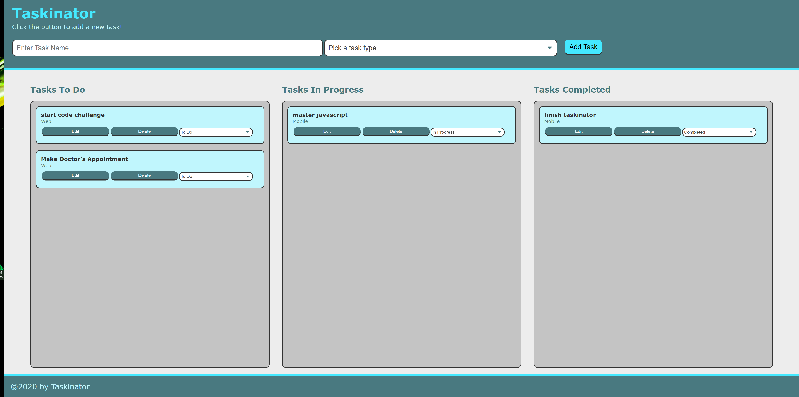

# Taskinator

## Productivity Application

* This a productivity app that allows the user to enter tasks and assign a status of "to do, in progress or completed" to those tasks.
* Existing tasks can be edited or deleted.
* This app supports drag and drop or a dropdwon box to change a tasks status.
* This app is written in Javascript, HTML5, and CSS.

# Screenshots




# Javascript Code Sample
```js
var createTaskEl = function (taskDataObj) {
    // create list item
    var listItemEl = document.createElement("li");
    listItemEl.className = "task-item";
    // add task id as a custom attribute
    listItemEl.setAttribute("data-task-id", taskIdCounter);
    listItemEl.setAttribute("draggable", "true");
    // create div to hold task info and add to list item
    var taskInfoEl = document.createElement("div");
    // give it a class name
    taskInfoEl.className = "task-info";
    // add HTML content to div
    taskInfoEl.innerHTML = "<h3 class='task-name'>" + taskDataObj.name + "</h3><span class='task-type'>" + taskDataObj.type + "</span>";
    // append task name and type to list item
    listItemEl.appendChild(taskInfoEl);
    var taskActionsEl = createTaskActions(taskIdCounter);
    listItemEl.appendChild(taskActionsEl);
    // append entire list item to list
    if (taskDataObj.status === "to do") {
        listItemEl.querySelector("select[name='status-change']").selectedIndex = 0;
        tasksToDoEl.appendChild(listItemEl);
    } else if (taskDataObj.status === "in progress") {
        listItemEl.querySelector("select[name='status-change']").selectedIndex = 1;
        tasksInProgressEl.appendChild(listItemEl);
    } else if (taskDataObj.status === "completed") {
        listItemEl.querySelector("select[name='status-change']").selectedIndex = 2;
        tasksCompleteEl.appendChild(listItemEl);
    }
    //add task id to task object and push object to array
    taskDataObj.id = taskIdCounter;
    tasks.push(taskDataObj);
    saveTasks();
    // increase task counter for next unique id
    taskIdCounter++;
}

